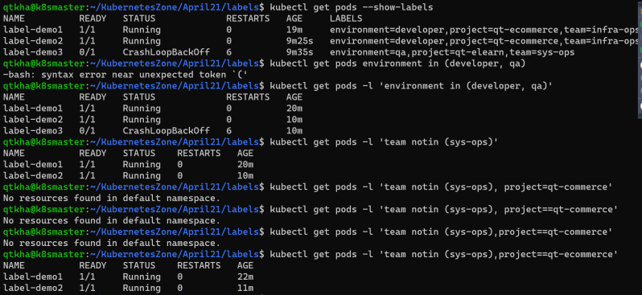
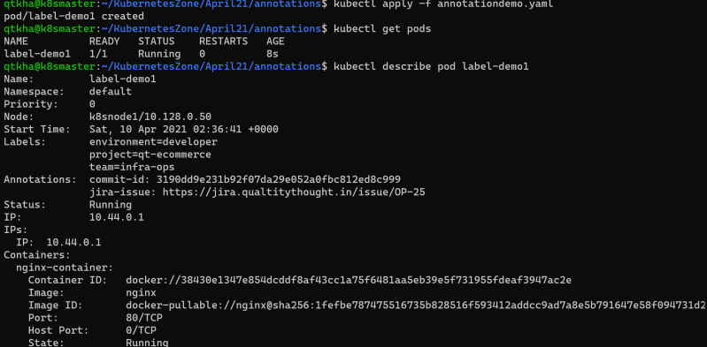

## Labels and Annotations
* Labels are the metadata that contains identifiable information to the kubernetes objects. These are basically key-value pairs     attached to the objects such as pods
* Each key must be unique for an object
* Labels would appear in metadata section and the yaml would appear as

        metadata:
        labels:
            key1: value1
            key2: value2

#### Constraints for Labels:
* Label prefix: This is optional and this must be a DNS subdomain. This cannot be longer thatn 253 characters & cannot contain spaces. The label prefix is always followed by a forwar slash Eg: directdevops.blog/. If no prefix is used the label key is assumed to be private to the user. label prefixes specific to k8s core system kubernetes.io/ and k8s.io/
* Label name: The label name is required and can be upto 63 characters long.

#### Value of the key in k8s is label-prefix/label-name or label-name
* Scenario: Lets create a ngnix pod with labels organized by team/project

        apiVersion: v1
        kind: Pod
        metadata:
        name: label-demo1
        labels:
            environment: developer
            team: infra-ops
            project: qt-ecommerce
        spec:
        containers:
            - name: nginx-container
            image: nginx
            ports:
                - containerPort: 80
                protocol: TCP 

### To change the labels
kubectl label --overwrite pod label-demo1 server=nginx-webserver

### To Remove the label
kubectl label pod label-demo1 server-

## Example :

        ---
        apiVersion: v1
        kind: Pod
        metadata:
        name: label-demo3
        labels:
            environment: qa
            team: sys-ops
            project: qt-elearn
        spec:
        containers:
            - name: mysql-container
            image: mysql
            ports:
                - containerPort: 3306
                protocol: TCP 

### We can query the objects using label selector

        kubectl get pods -l {label-selector}

## There are two types of label selectors
    * equality based
    * set-based

### Equality based selectors:
In this selector we have three kinds of operators = == !=

### SET-BASED Selectors
In this we have 3 kinds of operators in notin exists
Lets try some examples

# Annotations
* Using labels we can add metadata which can be later used to filter/select objects
* Annotations on the other hand have fewer constraints, however we cannot filter or select objects by annotations
* Annotations are generally used by tools or users to get subjective information regarding k8s object.
* Lets look at one annotation example Refer Here for the manifest

        ---
        apiVersion: v1
        kind: Pod
        metadata:
        name: label-demo1
        labels:
            environment: developer
            team: infra-ops
            project: qt-ecommerce
        annotations:
            commit-id: 3190dd9e231b92f07da29e052a0fbc812ed8c999
            jira-issue: "https://jira.qualtitythought.in/issue/OP-25"
        spec:
        containers:
            - name: nginx-container
            image: nginx
            ports:
                - containerPort: 80
                protocol: TCP

### Like what we have done in labels we can add/modify/delete annotations from kubectl

        kubectl annotate pod <podname> <annotate_key>=<annotate_value>
        kubectl annotate --overwrite pod <podname> <annotate_key>=<annotate_value>
        kubectl annotate pod <podname> <annotate_key>-

