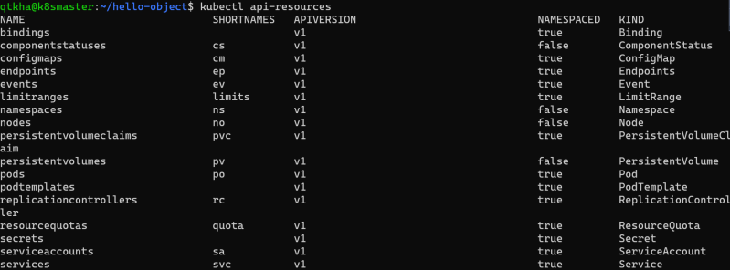

# K8s 
## k8s provides
        Service discovery and load balancing
        Storage Orchestration
        Automated rollouts and rollbacks
        Automatic bin packing
        Self healing
        Secret and configuration management

## Kubernetes Components

|Master | node | 
|-------|------|
|kube-apiserver|  kubelet |
|etcd | kube-proxy |
|kube-scheduler|  Container runtime |
|kube-controller-manager | Pod |
|cloud-controller-manager|  |

## Kubernetes Objects

        K8s objects are persistent entities of k8s system
        k8s object is "record of intent".
        Every k8s object will have an Object Specification (Spec) and object status
        The specificiation is about what we want and is regarded as desired state and the status is what is the actual state of object in k8s
        We specify object spec in the format of .yaml files and we get the status back after we apply the spec
        Lets take an example of the Pod spec

## sample yamil file 

        ---
        apiVersion: v1
        kind: Pod
        metadata:
        name: hello-pod
        labels:
            app: hello-pod
        spec:
        containers:
            - name: web
            image: httpd
            ports:
                - name: web
                containerPort: 80
                protocol: TCP
               

## Kubernetes API
    The core of the k8s control plane is the Api Server. This API server exposes HTTP API that lets enduser, different parts of your cluster and external components communicate with one another
        
    K8s stores the serialized state of objects by writing them to etcd
        
    To express the desired state we would be creating the specifications of the kubernetes resources
            Pod
            Container
            Ephemeral Containers
            Replication Controllers
            Replica Sets
            Deployments
            StatefulSets
            DaemonSet
            Job
            CronJob
            HorizontalPodAutoScaler

## kubectl api-resources
* Resources will have api-version, kind, Namespaced and some of the resources will have shortnames

* To create this resources we will be using kubectl and specify the spec in yaml file and then apply

#### API groups and versioning:
        API Groups make it easier to extend the k8s api. The API group is specified in the REST path and in the apiVersion field of serialized object
        There are several api groups
        The core group is found at REST path /api/v1. This is simply written as v1
        The named group: /api/$GROUP_NAME/$VERSION example: apiVersion: batch/v1

## kubectl  [# Referhere  for kubectl cheatsheat ](https://kubernetes.io/docs/reference/kubectl/cheatsheet/)
* This is a command line utility for interacting and performing various operation on k8s.
* Kubectl has two ways of managing your cluster
    * imperative:
        * We create objects by executing kubectl commands
    * declarative:
        * We create objects by specifying the desired state as specification in YAML format

## kubectl Communicates with k8s

* The API Server manages communications in k8s
* To achieve this , API-server implements the RESTful API over http and https to perform CRUD operations to populate and modify k8s API objects (pods, services, deployments)

## Pod
* This is smallest deployable units of computing in k8s
* A Pod consists of one or more containers with shared network and storage resources
* Each Pod will recieve a unique ip address
* To create any object in k8s we need to create a template
* To write the spec navigate to api reference [Refer Here](https://kubernetes.io/docs/reference/generated/kubernetes-api/v1.19/)
* [Refer Here](https://github.com/asquarezone/KubernetesZone/commit/2cd30bd9cb16740c2731c231cd8e4caee10744c7) for the pods specs created
* Now lets try to apply the pod spec created

## kubernetes namespace
* K8s supports multiple virtual cluster backed by same physical cluster and these virtual clusters are called as namespace
* In k8s for any object we have two kinds of scopes
    * cluster scope
    * namespace scope
* Commonly used kubectl commands
    * get object: In the resources which are scoped to namespace we can use -n to specify the namespace
        * kubectl get pods -n default

        
## Kubernetes HTTP Request Flow  [click_here for Restful api ](https://restfulapi.net/)

 
* The K8s API
    * K8s api uses JSON over http for its requests and responses.
    * k8s api allows clients to create, update, delete or read the    
    * description of object via standard http methods

